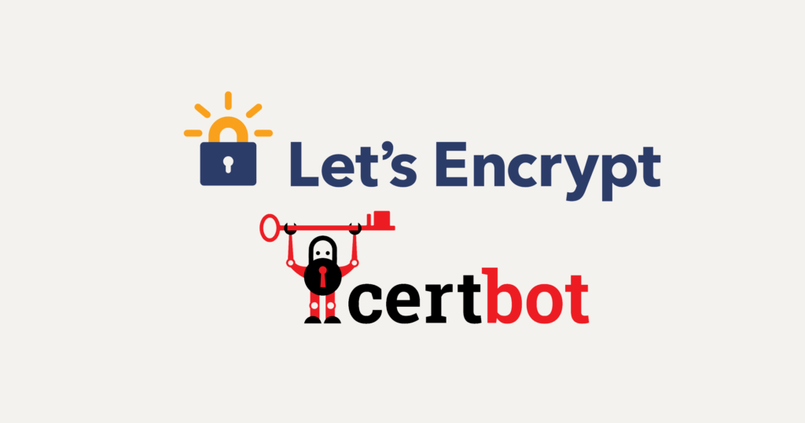

# Demo - PACMAN GAME - TERRAFORM + AUTO RENEW CERTIFICATES + LETSENCRYPT with CERTBOT


# Technologies we’ll use:

*  EC2 (compute instances)
*  Route53 (Amazon Route 53 is a highly available and scalable cloud Domain Name System (DNS) web service)
*  Apache (The Apache HTTP Server Project is an effort to develop and maintain an open-source HTTP server for modern operating systems including UNIX and Windows)
*  Terraform Version == v0.11.3
*  S.O == Ubuntu Xenial 16.04.4 LTS

# Steps before deploy:

1º Change your domain name in templates file & DNS

```bash

vim templates/init_update_machine.tpl
vim dns.tf

```

Ready?

# Deploy:

```bash
terraform plan
terraform apply

```


## AMIS<a name="amis"></a>
Within the file of `amis.tf` are defined the necessary amis to execute the proposed infrastructure.

### Ubuntu 16<a name="amis_ubuntu16"></a>

The official image manufactured by canonical is used

### DNS External *(público)*

This external dns zone is responsible for publishing the domain names so that they can be accessed via the Internet. Once this dns zone has been created, the nameservers provided by AWS must be propagated when creating the zone to the DNS parent management. Once this is done, you can add domain names and they will be public to the Internet.
The public names that are exposed to the Internet are:
- yourdomain

## Security<a name="sec"></a>

This infrastructure in the development environment is secured at different levels.
- The Apache is accessible from the Internet on ports 80 and 443.
- yourdomain is only accessible from the office IPs via SSH.

## Networking<a name="net"></a>

A VPC is created with CIDR `10.0.0.0.0/16`. The entire network definition is contained in the file `network.tf`.

## Certificate HTTPS 



They are automatically renewed by a cron , for more information see the template.

#Logs/Output


```bash
tail -f -n 2000 /var/log/cloud*

```

# Licence

MIT

# Information

https://certbot.eff.org/
https://letsencrypt.org/
https://github.com/platzhersh/pacman-canvas.git

David Álvarez Quiroga
